# MER del Proyecto

## Objetivo

Este archivo resume las entidades del proyecto y las relaciones detectadas directamente desde `app/models/*.py`.

Fuentes revisadas:

- `app/models/usuario_auth.py`
- `app/models/usuario.py`
- `app/models/habitos.py`
- `app/models/lecturas.py`
- `app/models/finanzas.py`
- `app/models/entrenamiento.py`
- `app/models/catalogo.py`
- `app/models/compras.py`
- `app/models/nutricion.py`

## Vista general

Los nodos más conectados hoy son:

- `usuarios.usuario`: eje principal de datos personales
- `catalogo.producto`: eje compartido entre compras y nutrición
- `entrenamientos.entrenamiento`: entidad base que se especializa en aeróbico o fuerza

## Diagrama MER

```mermaid
erDiagram
    AUTH_USER {
        int id PK
        string email
    }

    USUARIOS_USUARIO {
        int id_usuario PK
        int auth_user_id FK
        string username
        string email
    }

    HABITOS_CATEGORIA_HABITO {
        int id_categoria PK
        string nombre
    }

    HABITOS_HABITO {
        int id_habito PK
        int id_usuario FK
        int id_categoria FK
    }

    HABITOS_REGISTRO_HABITO {
        int id_registro PK
        int id_habito FK
    }

    LECTURAS_LIBROS {
        int id_libro PK
        string nombre_libro
    }

    LECTURAS_LECTURA {
        bigint id_lectura PK
        int id_usuario FK
        int id_libro FK
    }

    LECTURAS_REGISTRO_LECTURA {
        bigint id_registro PK
        int id_lectura FK
    }

    FINANZAS_BANCO {
        int id_banco PK
        string nombre_banco
    }

    FINANZAS_PRODUCTO_FINANCIERO {
        int id_producto_financiero PK
        int id_banco FK
        string nombre_producto
    }

    FINANZAS_CUENTA_USUARIO {
        int id_cuenta PK
        int id_usuario FK
        int id_producto_financiero FK
    }

    FINANZAS_CATEGORIA_FINANZA {
        int id_categoria PK
        string nombre
    }

    FINANZAS_MOVIMIENTO {
        int id_transaccion PK
        int id_categoria FK
        int id_cuenta FK
    }

    ENTRENAMIENTOS_GIMNASIO {
        int id_gimnasio PK
        string nombre_gimnasio
    }

    ENTRENAMIENTOS_ENTRENAMIENTO {
        int id_entrenamiento PK
        int id_usuario FK
        string tipo_entrenamiento
    }

    ENTRENAMIENTOS_ENTRENAMIENTO_AEROBICO {
        int id_aerobico PK
        int id_entrenamiento FK
    }

    ENTRENAMIENTOS_ENTRENAMIENTO_FUERZA {
        int id_entrenamiento_fuerza PK
        int id_entrenamiento FK
        int id_gimnasio FK
    }

    ENTRENAMIENTOS_EJERCICIOS {
        int id_ejercicio PK
        string nombre
        string tipo
    }

    ENTRENAMIENTOS_SERIE_FUERZA {
        int id_fuerza_detalle PK
        int id_entrenamiento_fuerza FK
        int id_ejercicio FK
    }

    CATALOGO_MARCA {
        int id_marca PK
        string nombre_marca
    }

    CATALOGO_PRODUCTO {
        int id_producto PK
        int id_marca FK
        string nombre_producto
        string codigo_barra
    }

    COMPRAS_CADENA {
        int id_cadena PK
        string nombre_cadena
    }

    COMPRAS_LOCAL {
        int id_local PK
        int id_cadena FK
        string nombre_local
    }

    COMPRAS_COMPRA {
        int id_compra PK
        int id_local FK
        int id_usuario FK
    }

    COMPRAS_COMPRA_DETALLE {
        int id_detalle PK
        int id_compra FK
        int id_producto FK
    }

    NUTRICION_CONSUMO {
        int id_consumo PK
        int id_usuario FK
    }

    NUTRICION_CONSUMO_DETALLE {
        int id_consumo_detalle PK
        int id_consumo FK
        int id_producto FK
    }

    NUTRICION_TABLA_NUTRICIONAL {
        int id_tabla PK
        int id_producto FK
    }

    NUTRICION_META_NUTRICIONAL {
        int id_meta PK
        int id_usuario FK
    }

    NUTRICION_PESO_USUARIO {
        int id_peso PK
        int id_usuario FK
    }

    AUTH_USER ||--|| USUARIOS_USUARIO : "auth_user_id"

    USUARIOS_USUARIO ||--o{ HABITOS_HABITO : "habitos"
    HABITOS_CATEGORIA_HABITO ||--o{ HABITOS_HABITO : "clasifica"
    HABITOS_HABITO ||--o{ HABITOS_REGISTRO_HABITO : "registros"

    USUARIOS_USUARIO ||--o{ LECTURAS_LECTURA : "lecturas"
    LECTURAS_LIBROS ||--o{ LECTURAS_LECTURA : "libro"
    LECTURAS_LECTURA ||--o{ LECTURAS_REGISTRO_LECTURA : "registros"

    FINANZAS_BANCO ||--o{ FINANZAS_PRODUCTO_FINANCIERO : "productos"
    FINANZAS_PRODUCTO_FINANCIERO ||--o{ FINANZAS_CUENTA_USUARIO : "cuentas"
    USUARIOS_USUARIO ||--o{ FINANZAS_CUENTA_USUARIO : "cuentas"
    FINANZAS_CATEGORIA_FINANZA ||--o{ FINANZAS_MOVIMIENTO : "categorias"
    FINANZAS_CUENTA_USUARIO ||--o{ FINANZAS_MOVIMIENTO : "movimientos"

    USUARIOS_USUARIO ||--o{ ENTRENAMIENTOS_ENTRENAMIENTO : "entrenamientos"
    ENTRENAMIENTOS_ENTRENAMIENTO ||--o| ENTRENAMIENTOS_ENTRENAMIENTO_AEROBICO : "aerobico"
    ENTRENAMIENTOS_ENTRENAMIENTO ||--o| ENTRENAMIENTOS_ENTRENAMIENTO_FUERZA : "fuerza"
    ENTRENAMIENTOS_GIMNASIO ||--o{ ENTRENAMIENTOS_ENTRENAMIENTO_FUERZA : "sesiones"
    ENTRENAMIENTOS_ENTRENAMIENTO_FUERZA ||--o{ ENTRENAMIENTOS_SERIE_FUERZA : "series"
    ENTRENAMIENTOS_EJERCICIOS ||--o{ ENTRENAMIENTOS_SERIE_FUERZA : "ejercicios"

    CATALOGO_MARCA ||--o{ CATALOGO_PRODUCTO : "productos"

    COMPRAS_CADENA ||--o{ COMPRAS_LOCAL : "locales"
    COMPRAS_LOCAL ||--o{ COMPRAS_COMPRA : "compras"
    USUARIOS_USUARIO ||--o{ COMPRAS_COMPRA : "compras"
    COMPRAS_COMPRA ||--o{ COMPRAS_COMPRA_DETALLE : "detalles"
    CATALOGO_PRODUCTO ||--o{ COMPRAS_COMPRA_DETALLE : "detalle"

    USUARIOS_USUARIO ||--o{ NUTRICION_CONSUMO : "consumos"
    NUTRICION_CONSUMO ||--o{ NUTRICION_CONSUMO_DETALLE : "detalles"
    CATALOGO_PRODUCTO ||--o{ NUTRICION_CONSUMO_DETALLE : "consumo"
    CATALOGO_PRODUCTO ||--o{ NUTRICION_TABLA_NUTRICIONAL : "tabla"
    USUARIOS_USUARIO ||--o{ NUTRICION_META_NUTRICIONAL : "metas"
    USUARIOS_USUARIO ||--o{ NUTRICION_PESO_USUARIO : "pesos"
```

## Relaciones por dominio

### Auth y usuarios

- `auth.user` 1 a 1 `usuarios.usuario`

`usuarios.usuario` es la entidad más transversal del proyecto y hoy se relaciona con:

- hábitos
- lecturas
- cuentas de usuario
- movimientos
- entrenamientos
- compras
- consumos
- metas nutricionales
- registros de peso

### Hábitos

- `habitos.categoria_habito` 1 a N `habitos.habito`
- `usuarios.usuario` 1 a N `habitos.habito`
- `habitos.habito` 1 a N `habitos.registro_habito`

### Lecturas

- `lecturas.libros` 1 a N `lecturas.lectura`
- `usuarios.usuario` 1 a N `lecturas.lectura`
- `lecturas.lectura` 1 a N `lecturas.registro_lectura`

### Finanzas

- `finanzas.banco` 1 a N `finanzas.producto_financiero`
- `finanzas.producto_financiero` 1 a N `finanzas.cuenta_usuario`
- `usuarios.usuario` 1 a N `finanzas.cuenta_usuario`
- `finanzas.categoria_finanza` 1 a N `finanzas.movimiento`
- `finanzas.cuenta_usuario` 1 a N `finanzas.movimiento`

### Entrenamientos

- `usuarios.usuario` 1 a N `entrenamientos.entrenamiento`
- `entrenamientos.entrenamiento` 1 a 0..1 `entrenamientos.entrenamiento_aerobico`
- `entrenamientos.entrenamiento` 1 a 0..1 `entrenamientos.entrenamiento_fuerza`
- `entrenamientos.gimnasio` 1 a N `entrenamientos.entrenamiento_fuerza`
- `entrenamientos.entrenamiento_fuerza` 1 a N `entrenamientos.serie_fuerza`
- `entrenamientos.ejercicios` 1 a N `entrenamientos.serie_fuerza`

### Catálogo, compras y nutrición

- `catalogo.marca` 1 a N `catalogo.producto`
- `compras.cadena` 1 a N `compras.local`
- `compras.local` 1 a N `compras.compra`
- `usuarios.usuario` 1 a N `compras.compra`
- `compras.compra` 1 a N `compras.compra_detalle`
- `catalogo.producto` 1 a N `compras.compra_detalle`
- `usuarios.usuario` 1 a N `nutricion.consumo`
- `nutricion.consumo` 1 a N `nutricion.consumo_detalle`
- `catalogo.producto` 1 a N `nutricion.consumo_detalle`
- `catalogo.producto` 1 a N `nutricion.tabla_nutricional`
- `usuarios.usuario` 1 a N `nutricion.meta_nutricional`
- `usuarios.usuario` 1 a N `nutricion.peso_usuario`

## Entidades puente o centrales

Si queremos ajustar el modelo, estas son las piezas más sensibles:

- `usuarios.usuario`: concentra casi todos los módulos personales
- `catalogo.producto`: conecta catálogo con compras y nutrición
- `entrenamientos.entrenamiento`: actúa como cabecera del entrenamiento y luego se especializa
- `finanzas.producto_financiero`: separa banco de cuenta usuario, lo que evita duplicar tipos de cuenta
- `finanzas.movimiento`: ahora depende de la cuenta como fuente de ownership, no del usuario directo

## Observaciones útiles para próximos ajustes

- La relación `auth.user` -> `usuarios.usuario` es efectivamente 1 a 1 porque `auth_user_id` es `unique=True`.
- `entrenamientos.entrenamiento` puede tener rama aeróbica o rama fuerza por `uselist=False` y `unique=True` en las tablas hijas.
- `entrenamientos.serie_fuerza` sí tiene FK hacia `entrenamientos.ejercicios`, pero `Ejercicios` no declara la relación inversa con `relationship()`.
- `lecturas.libros` existe como modelo y participa en el MER, aunque no aparece exportado en `app/models/__init__.py`.
- `catalogo.producto` hoy puede tener múltiples filas en `nutricion.tabla_nutricional`; si la intención fuera una sola tabla vigente por producto, faltaría una restricción `unique`.
- `compras.compra_detalle` y `nutricion.consumo_detalle` reutilizan `catalogo.producto`, así que cualquier cambio fuerte en productos impacta ambos módulos.

## Siguiente uso recomendado

Este archivo ya sirve para:

- detectar tablas maestras vs tablas transaccionales
- decidir dónde conviene agregar `unique`, `cascade` o borrado lógico
- discutir si algunas relaciones deberían ser 1 a 1 en vez de 1 a N
- planificar refactors por módulo sin perder las dependencias cruzadas
