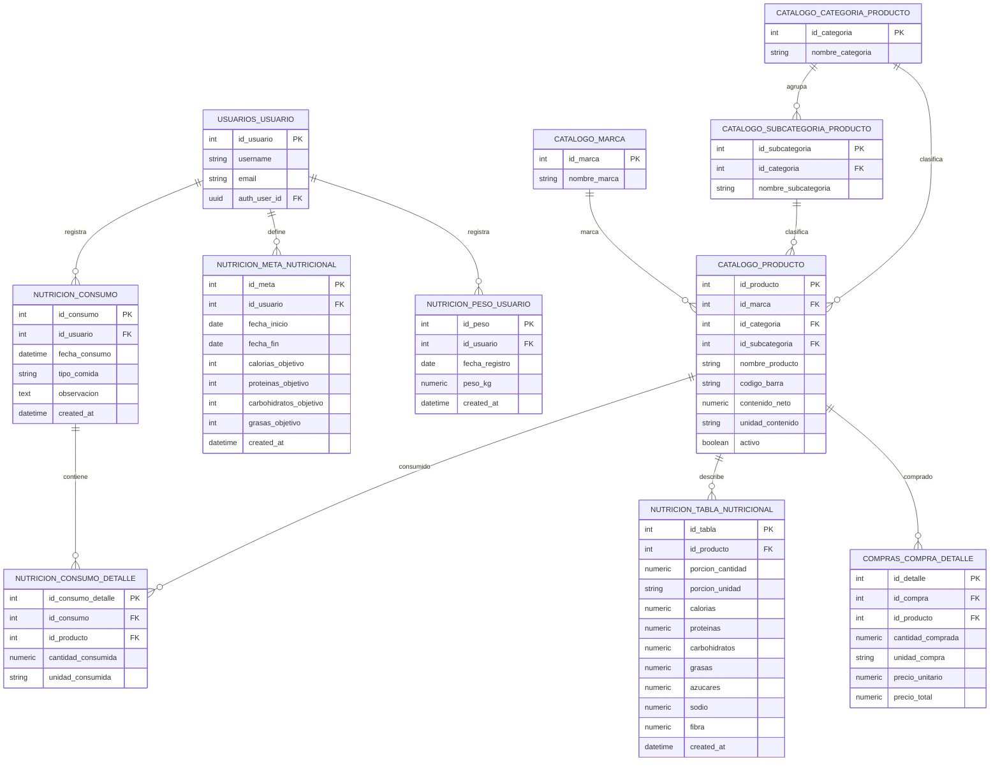

# Nutricion

Revision acotada del modulo de nutricion y de los modelos asociados por FK directa o por uso compartido de `catalogo.producto`.

## Archivos revisados

- Modelos: `app/models/nutricion.py`
- Modelos asociados: `app/models/usuario.py`, `app/models/catalogo.py`, `app/models/compras.py`
- Rutas: `app/routes/nutricion/*.py`, `app/routes/__init__.py`, `app/main.py`
- Schemas de entrada/salida: `app/schemas/nutricion/*.py`
- Migracion base del modulo: `app/alembic/versions/4f6a8c1b2d9e_add_catalogo_compras_nutricion_modules.py`

## Mermaid

## Relaciones del modulo

| Modelo | Tabla | FKs salientes | Relaciones ORM |
|---|---|---|---|
| `Consumo` | `nutricion.consumo` | `id_usuario -> usuarios.usuario.id_usuario` | `usuario`, `detalles` |
| `ConsumoDetalle` | `nutricion.consumo_detalle` | `id_consumo -> nutricion.consumo.id_consumo`, `id_producto -> catalogo.producto.id_producto` | `consumo`, `producto` |
| `TablaNutricional` | `nutricion.tabla_nutricional` | `id_producto -> catalogo.producto.id_producto` | `producto` |
| `MetaNutricional` | `nutricion.meta_nutricional` | `id_usuario -> usuarios.usuario.id_usuario` | `usuario` |
| `PesoUsuario` | `nutricion.peso_usuario` | `id_usuario -> usuarios.usuario.id_usuario` | `usuario` |

## Modelos asociados

| Schema | Modelo | Motivo |
|---|---|---|
| `usuarios` | `Usuario` | FK directa desde `consumo`, `meta_nutricional` y `peso_usuario`. Tambien declara backrefs `consumos`, `metas_nutricionales` y `pesos`. |
| `catalogo` | `Producto` | FK directa desde `consumo_detalle` y `tabla_nutricional`. Es el modelo compartido entre nutricion y compras. |
| `catalogo` | `Marca`, `CategoriaProducto`, `SubcategoriaProducto` | Asociados indirectos de nutricion porque `Producto` depende de ellos para marca y clasificacion. |
| `compras` | `CompraDetalle` | No apunta a nutricion, pero comparte la FK `id_producto -> catalogo.producto.id_producto`; cambios en productos impactan consumos, tablas nutricionales y compras. |

## Diccionario de rutas funcionando

Estas rutas estan registradas en la app FastAPI bajo `app.include_router(router)` con prefijo global `/api` y prefijo de modulo `/nutricion`. En esta revision, "funcionando" significa montadas y alcanzables por el router de FastAPI segun el codigo; no es una prueba end-to-end contra servidor y base de datos real.

### Consumo

| Metodo | Ruta | Handler | Acceso | Nota |
|---|---|---|---|---|
| `GET` | `/api/nutricion/consumo/` | `obtener_consumos` | usuario autenticado | Lista consumos del usuario actual, ordenados por `fecha_consumo desc`. |
| `GET` | `/api/nutricion/consumo/{id_consumo}` | `obtener_consumo` | usuario autenticado + ownership | Obtiene solo si `id_usuario` coincide con el usuario actual. |
| `POST` | `/api/nutricion/consumo/` | `crear_consumo` | usuario autenticado | Crea asignando `id_usuario` desde el usuario actual. |
| `PATCH` | `/api/nutricion/consumo/{id_consumo}` | `editar_consumo` | usuario autenticado + ownership | Rechaza patch vacio con `400`. |
| `DELETE` | `/api/nutricion/consumo/{id_consumo}` | `eliminar_consumo` | usuario autenticado + ownership | Elimina el consumo; ORM tiene cascade hacia detalles. |

### Consumo detalle

| Metodo | Ruta | Handler | Acceso | Nota |
|---|---|---|---|---|
| `GET` | `/api/nutricion/consumo-detalle/?id_consumo={id_consumo}` | `obtener_detalles_consumo` | usuario autenticado + ownership del consumo | Lista detalles de un consumo propio. |
| `GET` | `/api/nutricion/consumo-detalle/{id_consumo_detalle}` | `obtener_detalle_consumo` | usuario autenticado + ownership via consumo | Valida ownership haciendo join con `Consumo`. |
| `POST` | `/api/nutricion/consumo-detalle/` | `crear_detalle_consumo` | usuario autenticado + ownership del consumo | Valida que el consumo sea propio y que exista el producto. |
| `PATCH` | `/api/nutricion/consumo-detalle/{id_consumo_detalle}` | `editar_detalle_consumo` | usuario autenticado + ownership via consumo | Si cambia `id_producto`, valida que exista. |
| `DELETE` | `/api/nutricion/consumo-detalle/{id_consumo_detalle}` | `eliminar_detalle_consumo` | usuario autenticado + ownership via consumo | Elimina detalle propio. |

### Meta nutricional

| Metodo | Ruta | Handler | Acceso | Nota |
|---|---|---|---|---|
| `GET` | `/api/nutricion/meta/` | `obtener_metas` | usuario autenticado | Lista metas del usuario actual, ordenadas por `fecha_inicio desc`. |
| `GET` | `/api/nutricion/meta/{id_meta}` | `obtener_meta` | usuario autenticado + ownership | Obtiene solo metas propias. |
| `POST` | `/api/nutricion/meta/` | `crear_meta` | usuario autenticado | Crea asignando `id_usuario` desde el usuario actual. |
| `PATCH` | `/api/nutricion/meta/{id_meta}` | `editar_meta` | usuario autenticado + ownership | Rechaza patch vacio con `400`. |
| `DELETE` | `/api/nutricion/meta/{id_meta}` | `eliminar_meta` | usuario autenticado + ownership | Elimina meta propia. |

### Peso

| Metodo | Ruta | Handler | Acceso | Nota |
|---|---|---|---|---|
| `GET` | `/api/nutricion/peso/` | `obtener_pesos` | usuario autenticado | Lista registros del usuario actual, ordenados por `fecha_registro desc`. |
| `GET` | `/api/nutricion/peso/{id_peso}` | `obtener_peso` | usuario autenticado + ownership | Obtiene solo registros propios. |
| `POST` | `/api/nutricion/peso/` | `crear_peso` | usuario autenticado | Crea asignando `id_usuario` desde el usuario actual. |
| `PATCH` | `/api/nutricion/peso/{id_peso}` | `editar_peso` | usuario autenticado + ownership | Rechaza patch vacio con `400`. |
| `DELETE` | `/api/nutricion/peso/{id_peso}` | `eliminar_peso` | usuario autenticado + ownership | Elimina registro propio. |

### Tabla nutricional

| Metodo | Ruta | Handler | Acceso | Nota |
|---|---|---|---|---|
| `GET` | `/api/nutricion/tabla/` | `obtener_tablas` | usuario autenticado | Lista todas las tablas, ordenadas por `id_tabla desc`. |
| `GET` | `/api/nutricion/tabla/{id_tabla}` | `obtener_tabla` | usuario autenticado | Obtiene una tabla por id, sin ownership. |
| `POST` | `/api/nutricion/tabla/` | `crear_tabla` | superusuario | Valida que exista `Producto`. |
| `PATCH` | `/api/nutricion/tabla/{id_tabla}` | `editar_tabla` | superusuario | Si cambia `id_producto`, valida que exista. Rechaza patch vacio con `400`. |
| `DELETE` | `/api/nutricion/tabla/{id_tabla}` | `eliminar_tabla` | superusuario | Elimina tabla nutricional por id. |

## Observaciones

- `nutricion.tabla_nutricional.id_producto` no tiene `unique`; por diseno actual un producto puede tener varias tablas nutricionales.
- No hay `ondelete` explicito en las FKs de la migracion de nutricion. La eliminacion en cascada de `Consumo -> ConsumoDetalle` esta definida a nivel ORM con `cascade="all, delete-orphan"`, no a nivel DB.
- Las rutas de datos personales usan `current_user` y resuelven el `Usuario` de dominio con `obtener_usuario_actual`.
- Las rutas de escritura de tabla nutricional usan `current_superuser`, por lo que son de administracion aunque viven bajo `/api/nutricion/tabla`.
- No hay rutas agregadas de resumen nutricional; el modulo expone CRUDs de consumo, detalle, meta, peso y tabla.
